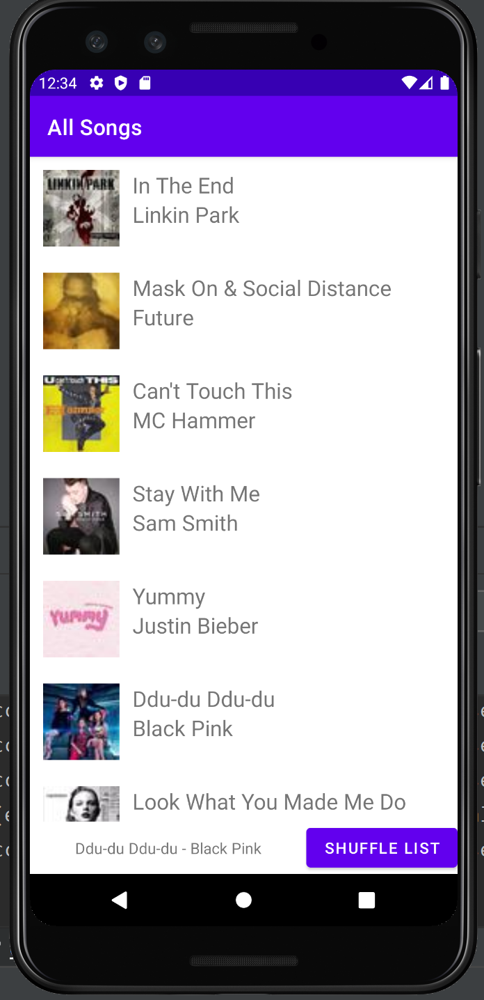
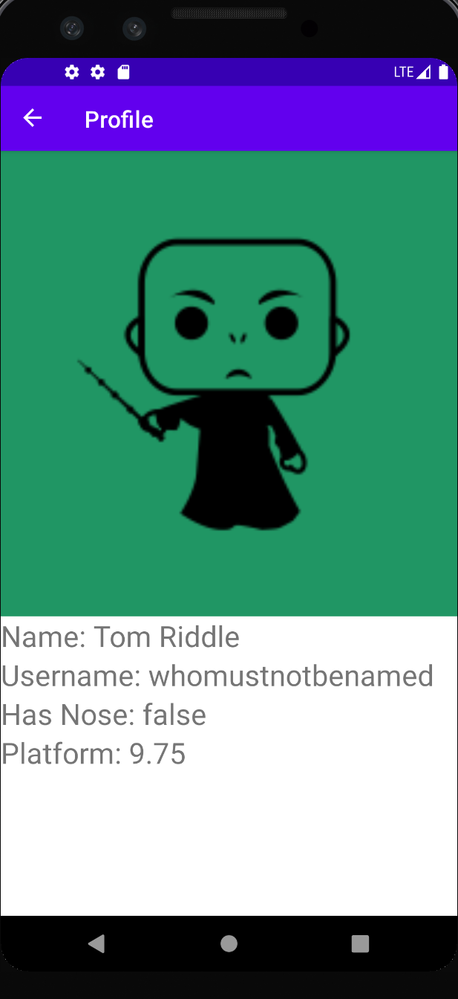
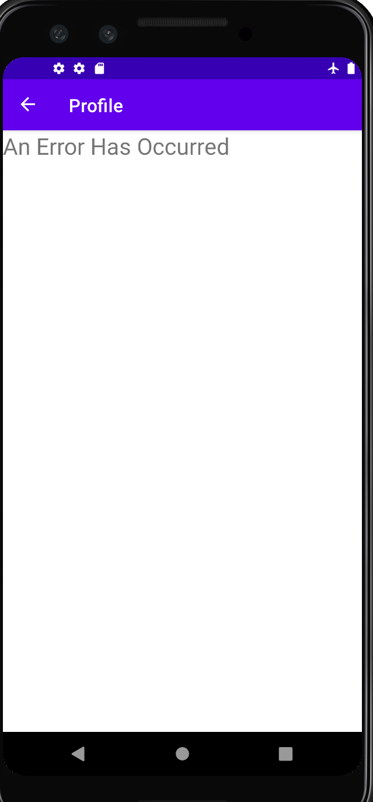

# Dotify - HW4 – Application, JSON parsing, HTTP REST calls

This is an app that let's the user listen to music from the cloud.

## Extra credit
I have completed extra credit #1 (Add pull down to refresh function to your activity to trigger an HTTP fetch)

## Screenshots

## Update Details
1. Android’s Application class is utilized to keep track of the number of songs the user clicks on.
   This number will be displayed with toasts.
2. An HTTP request is used to get information for the user profile. Coil is used to load the user image using the url from the http request.
   If the request fails an error message is displayed.

