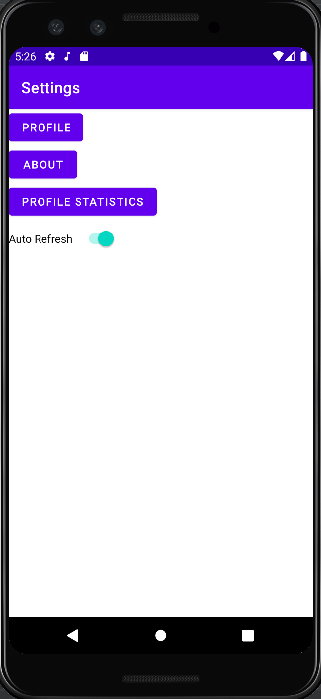
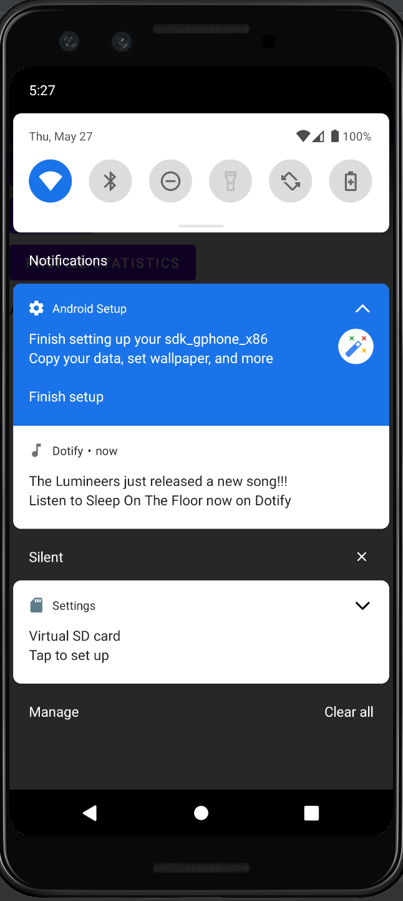

# Dotify - HW5 – Background Tasks & Notifications

This is an app that let's the user listen to music from the cloud.

## Extra credit
I have completed extra credit #1 (Tapping the notification launches PlayerActivity that passes the song data to the activity to show the song in the player 
)

## Screenshots

## Update Details
1. WorkManager and NotificationManager are used to create notifications of new songs every 20min. The toggle can be used to switch this off.
2. When the notification is clicked, the Player activity for the new song is opened.

