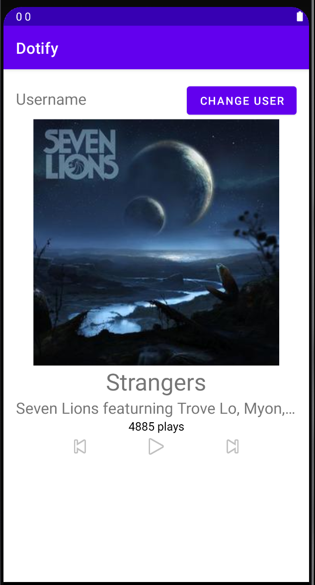

# Dotify by Midori Komi

This is an app that let's the user listen to music from the cloud.

## Extra credit
I have completed extra credit #1, #2, #3, and #5.

## Screenshots

## Installation & Usage
The number of plays is initially set to a random number and increases by 1 every time the play button is pressed
When the previous button is pressed, a brief notification of “Skipping to previous track” is shown
When the next button is pressed, a brief notification of “Skipping to next track” is shown
Click on the change user button to type in a new username and click on the apply button to apply
this change. If the new username typed is blank, an error message will pop up and a username will need
to be typed to apply the change.
Long press the cover photo of the song in order to change the color of the number of plays.

