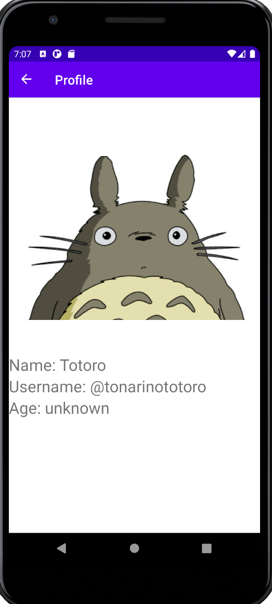

# Dotify - HW3 – Fragments, Activity Lifecycle & Rotation

This is an app that let's the user listen to music from the cloud.

## Extra credit
I have completed extra credit #1 (This criterion is linked to a Learning OutcomeEvery fragment has an Up/Back button other than SettingsFragment)

## Screenshots

## Installation & Usage
On song list page, long click a song to delete from list. 
Short click a song to add it to the mini player. 
Click the mini player to go to the single song page.
Click shuffle to shuffle list of songs. 

On single song page, the number of plays is initially set to a random number and increases by 1 every time the play button is pressed
When the previous button is pressed, a brief notification of “Skipping to previous track” is shown
When the next button is pressed, a brief notification of “Skipping to next track” is shown.
Long press the cover photo of the song in order to change the color of the number of plays.
Click back arrow to go to the song list page.

Go to the settings page to navigate to the profile page, about page, or statistics page.

